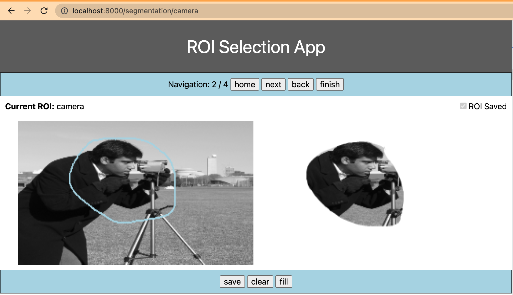
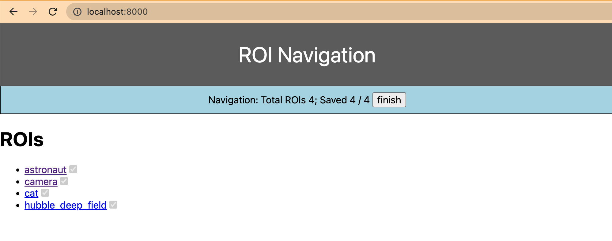

# PyROI
A simple front end interface to help with drawing Region of Interest (ROI) masks!




## Quickstart
```bash
git clone https://github.com/pfrwilson/PyROI
cd PyROI
pip install .
uvicorn example:app
```

## Motivation
This project is designed as a simple tool to perform ROI selection. It is a flexible tool only implementing the front end, and leaving the backend to the user through the `backends.SegmentationBackend` protocol.

## How to Use
Simply clone this project and install it into your python environment. Then you can implement the `SegmentationBackend` interface as you see fit: 

```python
from pyroi.backends import SegmentationBackend

class MyBackend(SegmentationBackend):
    ...
```

Then you can run the segmentation tool: 

`main.py`:
```python
from pyroi.segmentation_server import SegmentationServer

backend = MyBackend(...)
app = SegmentationServer(backend).app
```

command line:
```bash
uvicorn main:app
```
